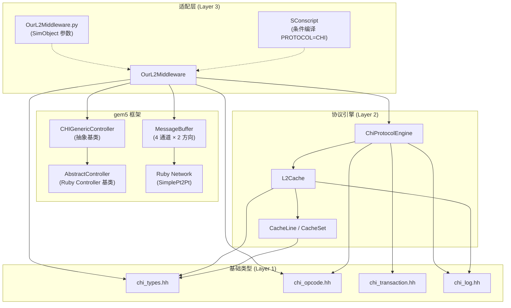
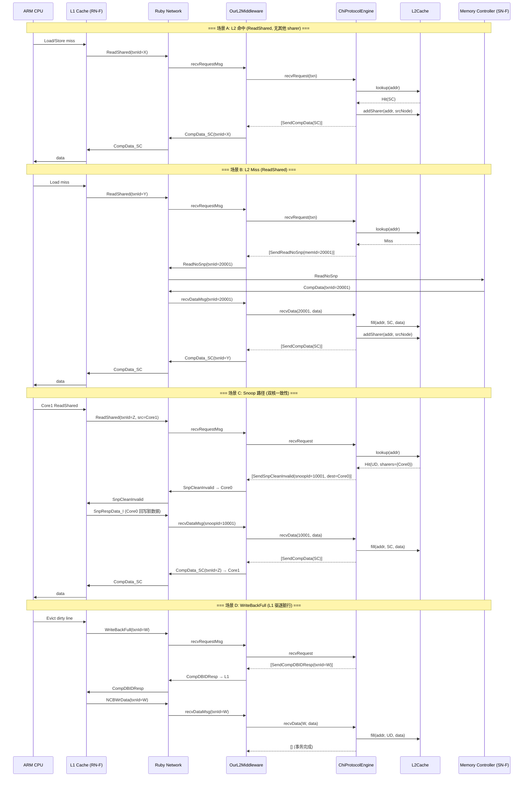
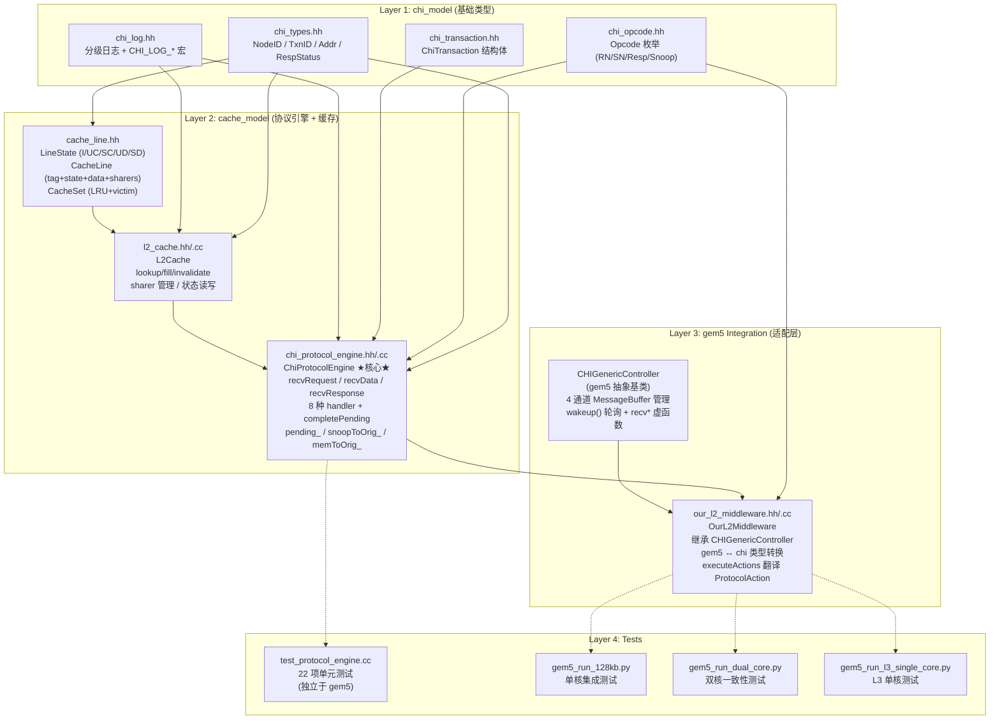
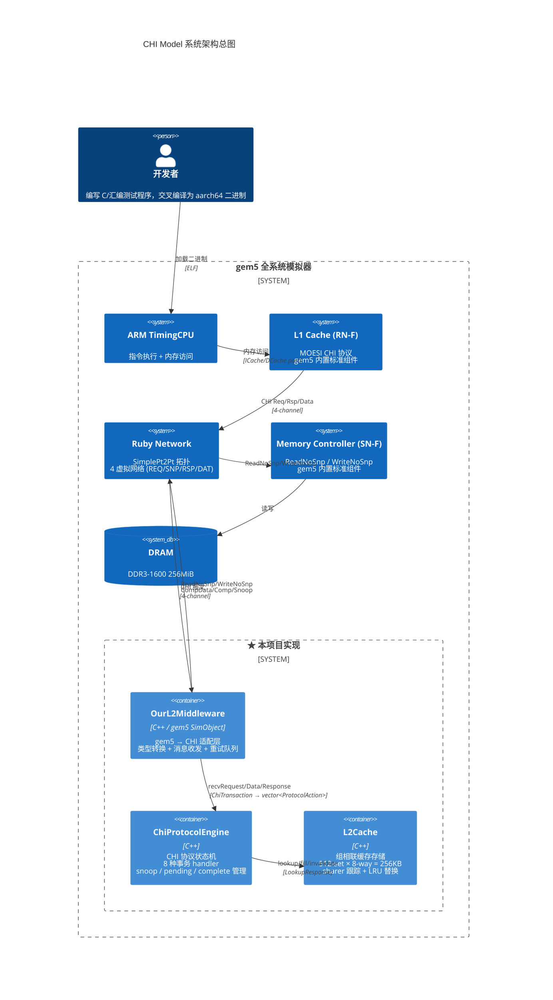
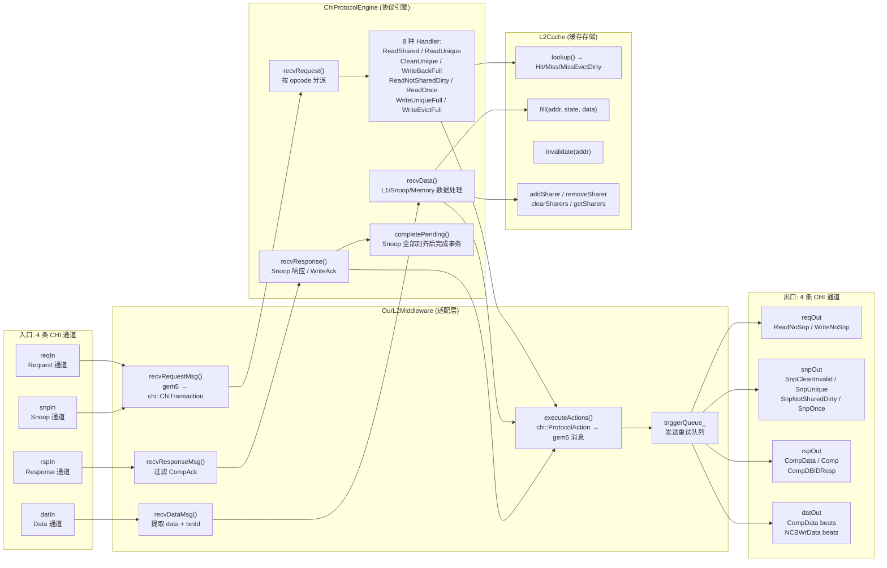

# CHI Model 架构总览

## 1. 系统整体概述与业务边界

本项目实现了一个基于 ARM AMBA CHI (Coherent Hub Interface) 协议的自定义 Home Node (HN-F) 缓存模型，作为 gem5 全系统模拟器的 Ruby 内存子系统的一部分运行。

### 业务边界

```
┌──────────────────────────────────────────────────────────────────────────┐
│                          gem5 全系统模拟器                                 │
│  ┌─────────┐  ┌─────────┐                                               │
│  │ ARM CPU │  │ ARM CPU │  ... (最多 N 核)                               │
│  └────┬────┘  └────┬────┘                                               │
│       │            │                                                     │
│  ┌────▼────┐  ┌────▼────┐                                               │
│  │  L1 I$  │  │  L1 I$  │  gem5 内置 MOESI CHI L1 (标准组件)             │
│  │  L1 D$  │  │  L1 D$  │                                               │
│  └────┬────┘  └────┬────┘                                               │
│       │            │                                                     │
│       └─────┬──────┘                                                     │
│             │  CHI 协议报文 (Request/Snoop/Response/Data)                 │
│             │  Ruby Network (SimplePt2Pt)                                │
│             │                                                            │
│       ╔═════▼══════════════════════════════════════════╗                  │
│       ║           ★ 本项目实现范围 ★                    ║                  │
│       ║  ┌──────────────────────────────────────────┐ ║                  │
│       ║  │         OurL2Middleware                   │ ║                  │
│       ║  │  (gem5 CHIGenericController 子类)         │ ║                  │
│       ║  │  ┌────────────────────────────────────┐  │ ║                  │
│       ║  │  │       ChiProtocolEngine             │  │ ║                  │
│       ║  │  │  (CHI 协议状态机，gem5 无关)         │  │ ║                  │
│       ║  │  │  ┌──────────────────────────────┐  │  │ ║                  │
│       ║  │  │  │         L2Cache               │  │  │ ║                  │
│       ║  │  │  │  (组相联缓存 + sharer 跟踪)    │  │  │ ║                  │
│       ║  │  │  └──────────────────────────────┘  │  │ ║                  │
│       ║  │  └────────────────────────────────────┘  │ ║                  │
│       ║  └──────────────────────────────────────────┘ ║                  │
│       ╚══════════════════════════════════════════════╝                  │
│             │                                                            │
│             │ ReadNoSnp / WriteNoSnp                                     │
│       ┌─────▼─────┐                                                      │
│       │  Memory    │  gem5 内置 Memory Controller (SN-F)                  │
│       │ Controller │                                                     │
│       └─────┬─────┘                                                      │
│             │                                                            │
│       ┌─────▼─────┐                                                      │
│       │   DRAM     │                                                     │
│       └───────────┘                                                      │
└──────────────────────────────────────────────────────────────────────────┘
```

**本项目负责的范围**：HN-F（Home Node with Full cache）—— 接收来自 RN-F（L1 Cache）的 CHI 请求，管理 L2/L3 缓存行状态和 sharer 跟踪，在需要时向其他 RN-F 发起 snoop，在 miss 时向 SN-F（Memory Controller）发起内存访问。

**不负责的范围**：CPU 模型、L1 Cache（gem5 标准 MOESI CHI）、Memory Controller（gem5 标准）、片上网络（gem5 Ruby Network）、DRAM 模型。

---

## 2. 分层架构与模块职责

```
┌─────────────────────────────────────────────────────────────────┐
│                     模块分层架构                                 │
├─────────────────────────────────────────────────────────────────┤
│                                                                 │
│  Layer 4: Test & Validation                                     │
│  ┌───────────────────────────────────────────────────────────┐  │
│  │  test/                                                     │  │
│  │  ├── test_protocol_engine.cc   单元测试 (22 项)             │  │
│  │  ├── gem5_run_128kb.py         单核集成测试                 │  │
│  │  ├── gem5_run_dual_core.py     双核一致性测试               │  │
│  │  └── gem5_run_l3_single_core.py L3 单核测试                 │  │
│  └───────────────────────────────────────────────────────────┘  │
│                          │                                       │
│  Layer 3: gem5 Integration (适配层)                              │
│  ┌───────────────────────────────────────────────────────────┐  │
│  │  gem5_integration/OurL2.py      Python SimObject 声明       │  │
│  │  gem5/src/mem/my_l2/                                        │  │
│  │  ├── our_l2_middleware.hh/.cc   中间件：gem5 ↔ Engine 适配  │  │
│  │  ├── OurL2Middleware.py         SimObject 参数定义          │  │
│  │  └── SConscript                 构建脚本                    │  │
│  └───────────────────────────────────────────────────────────┘  │
│                          │                                       │
│  Layer 2: CHI Protocol Engine (协议引擎，核心逻辑)               │
│  ┌───────────────────────────────────────────────────────────┐  │
│  │  cache_model/                                               │  │
│  │  ├── chi_protocol_engine.hh/.cc  协议状态机 (核心)          │  │
│  │  ├── l2_cache.hh/.cc             L2 组相联缓存              │  │
│  │  └── cache_line.hh               缓存行 / CacheSet 数据结构 │  │
│  └───────────────────────────────────────────────────────────┘  │
│                          │                                       │
│  Layer 1: CHI Basic Types (基础类型层，纯头文件)                 │
│  ┌───────────────────────────────────────────────────────────┐  │
│  │  chi_model/                                                 │  │
│  │  ├── chi_types.hh       NodeID, TxnID, Addr, RespStatus    │  │
│  │  ├── chi_opcode.hh      Opcode 枚举 + 字符串转换            │  │
│  │  ├── chi_transaction.hh ChiTransaction 结构体               │  │
│  │  └── chi_log.hh         日志系统 (CHI_LOG_*)               │  │
│  └───────────────────────────────────────────────────────────┘  │
│                                                                 │
└─────────────────────────────────────────────────────────────────┘
```

### 各模块职责

| 模块 | 文件 | 职责 |
|------|------|------|
| **chi_types** | `chi_types.hh` | 基础类型定义：`NodeID`(uint16), `TxnID`(uint32), `Addr`(uint64), `RespStatus` 枚举 |
| **chi_opcode** | `chi_opcode.hh` | 所有 CHI 操作码枚举（RN 请求、SN 请求、响应、Snoop 请求/响应）+ `opcodeToString()` |
| **chi_transaction** | `chi_transaction.hh` | `ChiTransaction` 结构体：封装一次 CHI 事务的全部信息 (opcode, addr, srcNodeID, txnID, data) |
| **chi_log** | `chi_log.hh` | 分级日志系统 (NONE/ERROR/WARN/INFO/DEBUG/TRACE)，通过 `CHI_LOG_LEVEL` 环境变量控制 |
| **cache_line** | `cache_line.hh` | `LineState` 枚举 (I/UC/SC/UD/SD 五态)、`CacheLine` (tag+state+data+sharers)、`CacheSet` (LRU + lookup + victim selection) |
| **l2_cache** | `l2_cache.hh/.cc` | 组相联缓存：地址解析 (tag/set/offset)、lookup/fill/invalidate、sharer 增删查、状态读写 |
| **chi_protocol_engine** | `chi_protocol_engine.hh/.cc` | **核心**：CHI 协议状态机。三个入口 (`recvRequest`/`recvData`/`recvResponse`)，按 opcode 分派 handler，管理 pending 事务和 snoop 跟踪 |
| **our_l2_middleware** | `our_l2_middleware.hh/.cc` | gem5 适配层：继承 `CHIGenericController`，将 gem5 CHI 消息翻译为 `ChiTransaction`，委托给 `ChiProtocolEngine`，将 `ProtocolAction` 翻译为 gem5 消息发送 |

---

## 3. 核心依赖关系



**依赖方向**: 基础类型 ← 缓存模型 ← 协议引擎 ← gem5 适配层 ← gem5 框架。`chi_model/` 和 `cache_model/` 完全不依赖 gem5，可独立编译和单元测试。

---

## 4. 调用链路与数据流

### 4.1 总体消息流



### 4.2 ChiProtocolEngine 内部调用链

```
recvRequest(ChiTransaction)
  │
  ├── Opcode::ReadShared ─────► handleReadShared()
  ├── Opcode::ReadUnique ─────► handleReadUnique()
  ├── Opcode::CleanUnique ────► handleCleanUnique()
  ├── Opcode::WriteBackFull ──► handleWriteBackFull()
  ├── Opcode::ReadNotSharedDirty ► handleReadNotSharedDirty()
  ├── Opcode::WriteUniqueFull ► handleWriteUniqueFull()
  ├── Opcode::WriteEvictFull ─► handleWriteEvictFull()
  ├── Opcode::ReadOnce ───────► handleReadOnce()
  │                              │
  │         ┌────────────────────┤
  │         │  cache_->lookup()  │
  │         │  ├── Hit ──────────┤
  │         │  │   ├── 无其他sharer → SendCompData / SendComp
  │         │  │   └── 有其他sharer → 发 Snoop → PendingState::WaitSnoopResp
  │         │  └── Miss ────────► SendReadNoSnp → PendingState::WaitMemData
  │         │
  └── default ─────────────────► SendReadNoSnp (透传)

recvData(txnId, addr, data)
  │
  ├── snoopToOrig_ 命中 ──────► 递减 pendingSnoopDataCount + pendingSnoopCount
  │                              └── 全部到齐 → completePending()
  ├── pending_ 命中 + WaitL1Data ► fill(UD) → 完成
  └── pending_ 命中 + WaitMemData ► fill() → addSharer → SendCompData/Comp

recvResponse(txnId, status)
  │
  ├── snoopToOrig_ 命中 ──────► 递减 pendingSnoopCount
  │                              └── 全部到齐 → completePending()
  └── pending_ 命中 + WaitMemWriteAck ► 清理 pending 条目

completePending(origTxnId)
  │
  └── clearSharers → setState(targetState) → addSharer → SendCompData/Comp
```

### 4.3 TxnID 管理策略

| TxnID 范围 | 用途 | 说明 |
|-----------|------|------|
| `0–63` | gem5 分配的 txnID | L1 发起的原始请求，gem5 的 `msg->gettxnId()` |
| `10000+` | Snoop txnID | 引擎内部 `nextSnoopTxnId_` 递增，用于 SnpCleanInvalid/SnpUnique 等 |
| `20000+` | Memory txnID | 引擎内部 `nextInternalTxnId_` 递增，用于 ReadNoSnp/WriteNoSnp |

**映射表**: `snoopToOrig_[snoopId] = origTxnId` 和 `memToOrig_[memId] = origTxnId` 在响应到达时将内部 txnID 翻译回原始 L1 txnID。

---

## 5. 模块关系图



---

## 6. Mermaid 架构总图



### 简化的数据流架构图



---

## 7. 已支持的事务矩阵

### 7.1 RN-F → HN-F 请求

| Opcode | Handler | 命中行为 | 未命中行为 |
|--------|---------|---------|-----------|
| `ReadShared (0x00)` | `handleReadShared` | UD/SD 且有其他 sharer → SnpCleanInvalid；其余直接 CompData(SC) | ReadNoSnp → WaitMemData → CompData(SC) |
| `ReadUnique (0x01)` | `handleReadUnique` | 有其他 sharer → SnpUnique；无其他 → CompData(UD) | ReadNoSnp → WaitMemData → CompData(UD) |
| `ReadNotSharedDirty (0x04)` | `handleReadNotSharedDirty` | 同 ReadUnique | 同 ReadUnique |
| `ReadOnce (0x07)` | `handleReadOnce` | UD/SD 且有其他 sharer → SnpOnce；其余直接 CompData (不添加 sharer) | ReadNoSnp → CompData (不添加 sharer) |
| `CleanUnique (0x02)` | `handleCleanUnique` | UC→Comp; UD→WriteNoSnp+Comp; SD→SnpNotSharedDirty; SC→SnpCleanInvalid | ReadNoSnp → Comp |
| `WriteBackFull (0x03)` | `handleWriteBackFull` | CompDBIDResp → WaitL1Data → fill(UD) | N/A |
| `WriteUniqueFull (0x05)` | `handleWriteUniqueFull` | 同 WriteBackFull | N/A |
| `WriteEvictFull (0x06)` | `handleWriteEvictFull` | 同 WriteBackFull | N/A |
| `Evict` | `invalidate()` (直通) | 直接失效 L2，返回 Comp_I | N/A |

### 7.2 HN-F → SN-F (内存访问)

| 事务 | 触发场景 |
|------|---------|
| `ReadNoSnp` | 所有读类请求的 L2 miss |
| `WriteNoSnp` | CleanUnique 命中 UD 状态时的脏数据写回 |

### 7.3 HN-F → RN-F (Snoop)

| 事务 | 使用场景 | L1 行为 |
|------|---------|--------|
| `SnpCleanInvalid` | ReadShared (UD/SD) / CleanUnique (SC) / ReadOnce (UD/SD) | 失效 + 回写脏数据 |
| `SnpUnique` | ReadUnique / ReadNotSharedDirty | 失效 + 回写脏数据 |
| `SnpNotSharedDirty` | CleanUnique (SD) | 保留 SC 副本 + 回写脏数据 |
| `SnpOnce` | ReadOnce (UD/SD) | 失效 + 回写脏数据 (不保留副本) |
| `SnpShared` | (已定义，待实现) | 共享数据，保留副本 |

---

## 8. 关键设计决策

### 8.1 同步引擎设计

`ChiProtocolEngine` 是纯同步的：每个 `recv*` 方法接收一个输入，返回 `vector<ProtocolAction>`。引擎内部不产生事件、不管理时序，只做协议状态转换。这种设计将协议逻辑与 gem5 的事件调度完全解耦。

### 8.2 ProtocolAction 抽象

引擎通过 `ProtocolAction` 枚举向适配层下达"需要发送什么消息"的指令。适配层负责将 `ProtocolAction` 翻译为具体的 gem5 消息。这意味着引擎可以独立编译和单元测试，无需链接 gem5。

### 8.3 TxnID 空间隔离

引擎使用 `10000+` 和 `20000+` 范围的自分配 txnID，避免与 gem5 分配的 `0-63` txnID 冲突。这在 gem5 集成中是经过实战验证的保守设计。

### 8.4 双集成路径

项目同时支持两条 gem5 集成路径：
- **OurL2Middleware** (主路径)：继承 `CHIGenericController`，支持 trigger queue 重试
- **OurL2Engine** (备选路径)：作为 SLICC external type，直接操作 MessageBuffer

当前主要使用和维护的是 OurL2Middleware 路径。

### 8.5 简化的一致性模型

与完整的 ARM CHI SPEC 相比，本实现做了以下简化：
- 不支持 DMT (Direct Memory Transfer) / DCT (Direct Cache Transfer)
- 不支持原子操作、DVM (Distributed Virtual Memory)
- 不支持流控 (RetryAck / PCrdGrant)
- 不支持 Cache 维护操作
- MissEvictDirty 尚未处理 (assert 阻止)

---

## 9. 关键数据结构

### PendingTxn (待处理事务)

```
struct PendingTxn {
    ChiTransaction origReq;       // 原始请求的完整副本
    PendingState   state;         // WaitMemData / WaitMemWriteAck / WaitSnoopResp / WaitL1Data
    LineState      targetState;   // 完成后缓存行应达到的状态
    int            pendingSnoopCount;      // 等待的 snoop 响应数量
    int            pendingSnoopDataCount;  // 等待的 snoop 数据数量
};
```

### PendingState 状态机

```
                    ┌─────────────────────────┐
                    │                         │
    ┌─────┐  miss   │  ┌──────────────────┐   │
    │ IDLE │────────┼─►│  WaitMemData     │───┼──► CompData/Comp (完成)
    └──────┘        │  └──────────────────┘   │
       │            │                         │
       │ hit+snoop  │  ┌──────────────────┐   │
       ├────────────┼─►│  WaitSnoopResp   │───┼──► completePending (完成)
       │            │  └──────────────────┘   │
       │            │                         │
       │ WB/Evict   │  ┌──────────────────┐   │
       ├────────────┼─►│  WaitL1Data      │───┼──► fill(UD) (完成)
       │            │  └──────────────────┘   │
       │            │                         │
       │ CleanUniq  │  ┌──────────────────┐   │
       │   +UD hit  │  │ WaitMemWriteAck  │   │
       └────────────┼─►│                  │───┼──► WriteAck (完成)
                    │  └──────────────────┘   │
                    └─────────────────────────┘
```

---

## 10. 文件清单

| 文件 | 行数 | 说明 |
|------|------|------|
| `chi_model/include/chi_types.hh` | ~20 | 基础类型定义 |
| `chi_model/include/chi_opcode.hh` | ~73 | Opcode 枚举 + 字符串转换 |
| `chi_model/include/chi_transaction.hh` | ~23 | ChiTransaction 结构体 |
| `chi_model/include/chi_log.hh` | ~77 | 日志系统 |
| `cache_model/include/cache_line.hh` | ~107 | CacheLine, CacheSet, LineState |
| `cache_model/include/l2_cache.hh` | ~90 | L2Cache 接口 |
| `cache_model/src/l2_cache.cc` | ~242 | L2Cache 实现 |
| `cache_model/include/chi_protocol_engine.hh` | ~124 | ChiProtocolEngine 接口 |
| `cache_model/src/chi_protocol_engine.cc` | ~738 | ChiProtocolEngine 实现 (★核心) |
| `gem5_integration/OurL2.py` | ~15 | SimObject Python 声明 |
| `gem5/src/mem/my_l2/our_l2_middleware.hh` | ~87 | OurL2Middleware 接口 |
| `gem5/src/mem/my_l2/our_l2_middleware.cc` | ~523 | OurL2Middleware 实现 |
| `test/test_protocol_engine.cc` | — | 22 项单元测试 |
| `test/gem5_run_128kb.py` | — | 单核集成测试脚本 |
| `test/gem5_run_dual_core.py` | ~235 | 双核一致性测试脚本 |
| `test/gem5_run_l3_single_core.py` | — | L3 单核测试脚本 |
